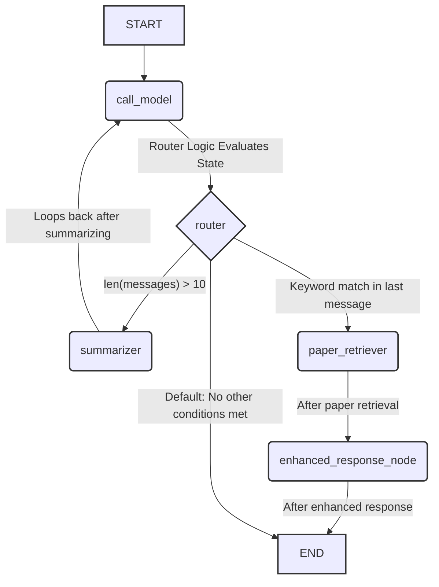

# Research Assistant

A conversational AI assistant for searching and discussing research papers.

## Features
- Search for relevant papers based on user queries
- Provide detailed information about research papers
- Token management through context summarization
- Routing between general conversation and research assistance

## Technologies
- LangChain framework for LLM interactions
- LangGraph for conversation flow management
- SQLite for conversation persistence
- ChromaDB for vector storage and retrieval
- Gradio for the web interface

## App Architecture
The application uses a state machine graph structure with these key components:
- `call_model`: Handles basic conversation
- `router`: Directs flow based on message content
- `paper_retriever`: Fetches relevant research papers
- `enhanced_response_node`: Provides detailed paper responses
- `summarizer`: Creates conversation summaries when needed
  

